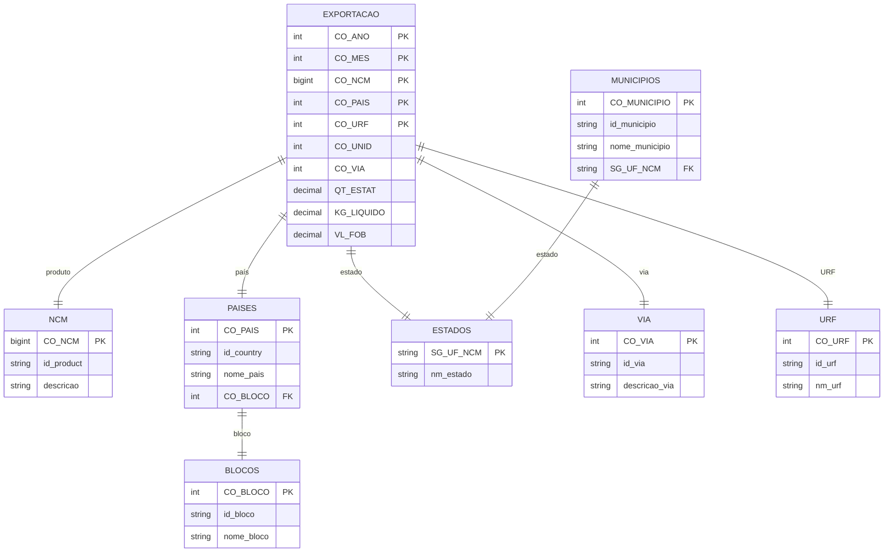

# Modelo de Dados

## Star Schema

O projeto implementa um modelo dimensional **Star Schema** para análise de dados de exportação.

```
                    ┌─────────────────┐
                    │   dim_tempo     │
                    │  (ano, mês,     │
                    │  trimestre)     │
                    └────────┬────────┘
                             │
                             │
    ┌─────────────┐    ┌─────┴─────────┐    ┌─────────────┐
    │ dim_produto │    │ fato_export   │    │  dim_pais   │
    │  (NCM,      │◄───┤  (métricas:   ├───►│  (país,     │
    │   nome)     │    │  VL_FOB,      │    │  bloco)     │
    └─────────────┘    │  KG_LIQUIDO,  │    └─────────────┘
                       │  QT_ESTAT)    │
                       └─────┬─────────┘
                             │
         ┌───────────────────┼───────────────────┐
         │                   │                   │
         ▼                   ▼                   ▼
┌─────────────────┐  ┌─────────────────┐  ┌─────────────────┐
│   dim_estado    │  │    dim_via      │  │    dim_urf      │
│  (UF, nome,     │  │  (código,       │  │  (código, nome, │
│   região)       │  │   descrição)    │  │   município)    │
└─────────────────┘  └─────────────────┘  └─────────────────┘
```

---

## Diagrama ER

Visualização completa do modelo conceitual disponível em:
`output/modelo_conceitual.html`

### Entidades e Relacionamentos



---

## Tabelas de Dimensão

### dim_tempo

| Coluna | Tipo | Descrição |
|--------|------|-----------|
| tempo_id | INT PK | ID autoincremental |
| CO_ANO | INT | Ano (ex: 2025) |
| CO_MES | INT | Mês (1-12) |
| nome_mes | VARCHAR(20) | Nome do mês |
| trimestre | INT | Trimestre (1-4) |
| semestre | INT | Semestre (1-2) |
| nome_trimestre | VARCHAR(15) | T1, T2, T3, T4 |
| ano_mes | VARCHAR(7) | Formato YYYY-MM |

### dim_produto

| Coluna | Tipo | Descrição |
|--------|------|-----------|
| produto_id | INT PK | ID autoincremental |
| CO_NCM | BIGINT UK | Código NCM |
| id_product | VARCHAR(100) | Nome do produto |
| descricao_produto | TEXT | Descrição completa |
| categoria_produto | VARCHAR(50) | Categoria |

### dim_pais

| Coluna | Tipo | Descrição |
|--------|------|-----------|
| pais_id | INT PK | ID autoincremental |
| CO_PAIS | INT UK | Código do país |
| id_country | VARCHAR(100) | Nome do país |
| nome_pais | VARCHAR(100) | Nome formatado |
| CO_BLOCO | INT FK | Código do bloco |
| nome_bloco | VARCHAR(50) | Nome do bloco |

### dim_estado

| Coluna | Tipo | Descrição |
|--------|------|-----------|
| estado_id | INT PK | ID autoincremental |
| SG_UF_NCM | CHAR(2) UK | Sigla (SP, RJ, etc) |
| nm_estado | VARCHAR(50) | Nome completo |

### dim_via

| Coluna | Tipo | Descrição |
|--------|------|-----------|
| via_id | INT PK | ID autoincremental |
| CO_VIA | INT UK | Código da via |
| id_via | VARCHAR(50) | Identificador |
| descricao_via | VARCHAR(100) | Descrição |

### dim_urf

| Coluna | Tipo | Descrição |
|--------|------|-----------|
| urf_id | INT PK | ID autoincremental |
| CO_URF | INT UK | Código URF |
| id_urf | VARCHAR(100) | Identificador |
| nm_urf | VARCHAR(100) | Nome da URF |
| CO_MUNICIPIO | INT | Código do município |

---

## Tabela Fato

### fato_exportacao

| Coluna | Tipo | Descrição |
|--------|------|-----------|
| exportacao_id | BIGINT PK | ID autoincremental |
| tempo_id | INT FK | Referência dim_tempo |
| produto_id | INT FK | Referência dim_produto |
| pais_id | INT FK | Referência dim_pais |
| estado_id | INT FK | Referência dim_estado |
| via_id | INT FK | Referência dim_via |
| urf_id | INT FK | Referência dim_urf |
| **QT_ESTAT** | DECIMAL(15,3) | Quantidade estatística |
| **KG_LIQUIDO** | DECIMAL(15,3) | Peso líquido |
| **VL_FOB** | DECIMAL(15,2) | Valor FOB |

### Índices Recomendados

```sql
-- Performance para consultas analíticas
CREATE INDEX idx_fato_tempo_produto ON fato_exportacao(tempo_id, produto_id);
CREATE INDEX idx_fato_pais_tempo ON fato_exportacao(pais_id, tempo_id);
CREATE INDEX idx_fato_estado ON fato_exportacao(estado_id);
```

---

## Views para Power BI

O script SQL gerado (`output/comexstat_mysql_schema.sql`) inclui views otimizadas:

### v_exportacoes_consolidadas

View principal com JOINs de todas as dimensões.

### v_analise_produto

Agregação por produto, ano e mês.

### v_analise_pais

Agregação por país e período.

### v_analise_estado

Agregação por estado brasileiro.

---

## Convenções de Nomenclatura

| Elemento | Convenção | Exemplo |
|----------|-----------|---------|
| Tabelas | prefixo + underscore | `dim_produto`, `fato_exportacao` |
| Chaves primárias | sufixo _id | `produto_id` |
| Chaves estrangeiras | FK explícita | `FOREIGN KEY (pais_id)` |
| Métricas | nomes descritivos | `VL_FOB`, `KG_LIQUIDO` |
